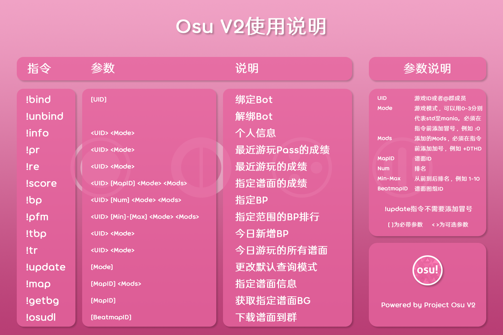

# osuv2

基于HoshinoBot v2的osu api v2版本的查询模块

项目地址：https://github.com/Yuri-YuzuChaN/osuv2

# 重做中，尚未进行完整测试，暂时无法使用

## 使用方法

1. 将该项目放在HoshinoBot插件目录 `modules` 下，或者clone本项目 `git clone https://github.com/Yuri-YuzuChaN/osuv2`
2. 在 `OAuth.json` 填入申请的 `client_id`，`client_secret`，[如何申请 OAuth 客户端](#如何申请OAuth客户端)
3. 安装第三方依赖：`pip install -r requirements.txt`
4. 在`config/__bot__.py`模块列表中添加`osuv2`
5. 重启HoshinoBot

**注：`pillow`需要高于等于8.0.0版本**

## 如何申请OAuth客户端

1. 打开osu个人设置页面：https://osu.ppy.sh/home/account/edit ，拉到最下面开放授权页面。

2. 点击`新的 OAuth 应用`，在弹出的窗口填入`应用名称`（随意），`应用回调链接`（第三方网站或自己的网站），点击`注册应用程序`，此时你已经拥有了 `OAuth客户端`

3. [进行使用方法第二步](#使用方法)

## 指令说明
### 如果看不懂可以可以查看 [使用说明](https://sakura.yuzuai.xyz/plugins/rhythmgame/osu!.html)

## 更新说明

**2023-09-13**

1. 推倒重做所有模块

## 历史更新

    
 说明 

**2022-10-12**

1. 重写画图，指令 `score` 和 `bp` 的逻辑
2. 修复acc画图内存泄漏的问题
3. 新增指令 `pr`，查询最近的游玩pass记录
4. 新增指令 `tr`，查询当天游玩Pass的谱面
5. 查询成绩不再下载整个地图谱面，只下载单一谱面且不保存，节省时间和空间
6. 再次修改PP计算器api地址及PP请求源码，现已提供api使用说明：[PP计算器API](https://sakura.yuzuai.xyz/API/osu!.html)

**2022-01-07**

1. 修改PP计算器api地址及PP请求源码，现已提供api使用说明：[PP计算器API](https://sakura.yuzuai.xyz/API/osu!.html)

**2021-11-22**

1. 修复更新token失败时一直重复更新导致死循环的问题

**2021-11-19**

1. 修复`update`指令无法更改查询模式的问题
2. 修复`pfm`指令查询个别玩家bp不足100个的问题
3. 修复新版本pp计算器返回结果不一致的问题

**2021-11-11**

1. 新增`tbp`指令，查询当天新增的BP成绩，时间范围为当天的00:00到23:59
2. 修复`pfm`指令无法查询TA的问题
3. `token`的更新方式已修改为检测到`token`过期时自动更新，不在定时更新，手动更新的指令保留
4. 优化不存在的用户的返回结果

**2021-10-17**

1. 修复`info`指令无法查询未游玩过的模式

**2021-10-16**

1. 修改数据库结构
3. 修改`token`请求，不再重复读取文件
4. 修改图片发送方式为`base64`编码，不再保存输出图片，以节省空间
5. 修改`bp`指令的参数
6. 修改std成绩图片，新增`aim`，`acc`，`speed`，`if fc`，`if ss` pp的计算
7. 移除`bp`指令查询指定范围成绩的功能，修改为单独的指令`pfm`
8. 移除`smap`指令，不再支持搜索地图
9. 不再保存头像和头图，.osu文件，仅保留背景图片
10. 新增全模式PP计算，提供api接口，无文档
11. 新增指令`pfm`指令，查询指定范围成绩

**2021-08-06**

1. 修复图版本获取失败的问题

**2021-07-29**

1. 更新新版渐变色难度模式图标

**2021-07-09**

1. 修复ctb和taiko模式`pp`变量错误

**2021-07-08**

1. 修复无法自动更新个人信息的问题

**2021-07-06**

1. 数据处理移动到`data.py`
2. 修改部分函数名称
3. 不再保存cover及badges图片
4. 修改所有成绩图

**2021-06-11**

1. 为区分图组与单图，已将图组`bmapid`修改为`setid`
2. 修复地图在没有背景制图错误的问题
3. 修复`get_token.py`无法申请token的问题
4. 修改报错提示
5. 将`draw.py`文件的`FILEHTTP`字符串移至`http.py`

**2021-05-29**

1. 新增查询图组功能，指令：`bmap [bmapid]`，`bmapid`为图组id，或者使用地图id`mapid`查询图组，在指令加`-b`，例：`bmap -b [mapid]`
2. 修改`map`指令，并增加音乐分享，音乐分享需使用`http`服务，请自行修改`draw.py`文件中的`FILEHTTP`字符串，将地址改为自己的服务器IP或域名，`:{PORT}/map`请勿删除
3. 完善api请求，准确返回无法查询的错误
4. 修复所有指令无法查询TA人的问题
5. 修复指令@人无法查询的问题

**2021-05-23**

1. 修改`bp`指令，改用图片的形式发送
2. `info`，`recent`，`score`指令可使用@方式查询群友的成绩或信息

**2021-05-16**

1. 修改`map`指令，改用图片的形式发送
2. 修复`smap`指令搜索个别ranked地图没有背景的问题

**2021-05-06**

1. 新增地图搜索功能，指令：`[smap keyword]`，`keyword`为关键词，可多个，默认搜索std模式ranked状态
2. 新增地图下载功能，指令：`[osudl bmapid]`，`bmapid`为地图组id，非单图id

**2021-05-04**

1. 支持`mania`模式pp计算

**2021-05-02**

1. 修复`map`指令查询非ranked图时出错的问题
2. 修复`map`指令查询mania图时无max combo的问题

**2021-04-27**

1. 修复撒泼特错位
2. 修复info的游玩时间
3. 对比信息无法更新

**2021-04-23**

1. 船新版本的osu插件

